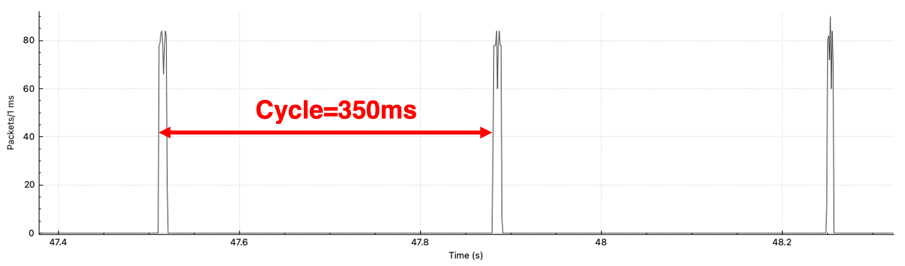

# clumsy-reg

__A clumsy-based Windows traffic shaper__

Repurosed the "throttled" function in clumsy into a on-off shaping tool.

## Usage

Run clumsy.exe in ``bin`` folder,  enable "on-off shaping", and set cycle to corresponding long DRX cycle.
 - Due to the limistation of WinDivert, this tool cannot control the duration of on-time. The throttled buffer is flushed at the end of each cycle.
 - Please do not enable other functionalities which will disturbe traffic shaper's timing.
 - Tested cycle range: 20ms-1000ms. Large number of packets (>50 packets/ms) may introduce processing latency that offsets the cycle timing.

## Build

See [this page](http://jagt.github.io/clumsy/download.html) for build instructions.
Use ``-Dconf=Debug`` to enable log console at runtime.
